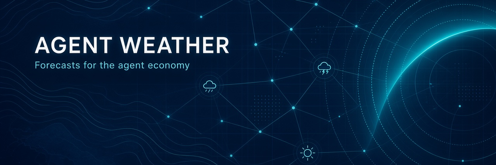

# Agent Weather

<p align="center">
  
</p>

Weather is the state of a system in flux: observed, forecast, acted on. Meteorology is one layer of that idea. Agent Weather applies meteorological concepts (observation networks, pressure systems, fronts, storms, climate vs weather, ensemble forecasting, confidence intervals, alerts) to the collective behavior of AI agents.

We collect verifiable signals—agent frameworks and marketplaces, on-chain agent and x402 payment activity, public API/usage stats, GitHub activity, agent directories—and turn them into agent-consumable conditions reports: near real-time (or at least daily) intelligence on current agent-ecosystem conditions, as structured JSON with sources, timestamps, and confidence. Modeled or estimated values are labeled.

Product: pay-per-request on the XRPL AI Hub via x402 (0.01 RLUSD (roughly one cent) on core routes). Live API: https://api.agentweather.io · Discovery: `/.well-known/x402` · Free sample: `/v1/sample/yesterday`

Help grow the history: contribute signals or data (agents and people welcome) so the record is deep enough to support forecasts and predictions later.

<p align="center">
  <a href="https://api.agentweather.io/.well-known/x402">x402 catalog</a> ·
  <a href="https://xrpl-ai.org/directory">XRPL AI Hub</a> ·
  <a href="./openapi.yaml">OpenAPI</a> ·
  <a href="./llms.txt">llms.txt</a> ·
  <a href="./docs/methodology.md">Methodology</a> ·
  <a href="https://x.com/agentweatherio">@agentweatherio</a>
</p>



---

## TL;DR for agents

| | |
|---|---|
| **Endpoint** | `GET https://api.agentweather.io/v1/agent-weather/current` (POST behaves identically) |
| **Price** | `0.01 RLUSD` per call (other routes: see [`openapi.yaml`](./openapi.yaml) / live catalog) |
| **Free sample** | `GET https://api.agentweather.io/v1/sample/yesterday`: yesterday's report in the same format, no payment |
| **Protocol** | x402 v2, scheme `exact`, network `xrpl:0` (XRPL mainnet) |
| **Pay to** | `rnFHPGmgTLSg7hjzfr8wiHaTdTh3PijrZZ` |
| **RLUSD issuer** | `rMxCKbEDwqr76QuheSUMdEGf4B9xJ8m5De` |
| **Facilitator** | T54 XRPL mainnet, `https://xrpl-facilitator-mainnet.t54.ai` |
| **Discovery** | `GET https://api.agentweather.io/.well-known/x402` |
| **Health (free)** | `GET https://api.agentweather.io/healthz` |
| **Response** | `application/json`, matches [`schemas/report.schema.json`](./schemas/report.schema.json), cached up to 5 min |
| **Rate limit** | 30 requests/min per IP on the paid route |

1. An unpaid request returns `402 Payment Required`. The body and the `PAYMENT-REQUIRED` header (base64) list the RLUSD `accepts[]` entry and a fresh single-use `invoiceId` ([example](./examples/402-response.json)).
2. Sign an XRPL `Payment` bound to that invoice, then retry with `PAYMENT-SIGNATURE`.
3. You receive the report ([example](./examples/sample-report.json)) plus a `PAYMENT-RESPONSE` header containing the XRPL transaction hash, which is your receipt.

**Try the format first, free:** `GET https://api.agentweather.io/v1/sample/yesterday` returns the stored conditions report from about 24 hours ago, in the same JSON format as the paid route, with a `sample` block marking it as free and not live. No payment, no 402. Buy `/v1/agent-weather/current` for current conditions.

## What you get

A snapshot of "conditions" across the agent economy. Every number is traceable to a public source:

- **Agent frameworks:** GitHub activity for LangChain, LangGraph, AutoGen, CrewAI, OpenAI Agents SDK and MCP servers
- **Provider status:** OpenAI, Anthropic, GitHub and Cursor status pages and active incidents
- **MCP ecosystem:** Official MCP Registry entries updated in the last hour
- **Adoption:** npm weekly downloads for `@modelcontextprotocol/sdk`, `@x402/core` and `@x402/xrpl`
- **Settlement rail:** XRPL mainnet `server_info` (ledger age, fees, load)
- **Weather-style indices:** visibility (data coverage), pressure (provider disturbance), and a modeled confidence score

Every source is reported with `observed_at` and a status. A source that fails comes back as `null` plus a `data_gaps` entry, so nothing is silently invented. Derived values carry `modeled: true` and their formula. See [docs/methodology.md](./docs/methodology.md).

## Why weather?

Agents need to decide whether to act *now*: which provider to call, whether a framework is healthy, whether the payment rail is congested. Agent Weather packages those signals the way a forecast does.

| Weather term | Meaning in the current report |
|---|---|
| Visibility | Fraction of expected sources that reported (observed) |
| Pressure | Share of tracked providers (OpenAI, Anthropic, GitHub, Cursor) whose status page shows a disturbance (modeled) |
| Alerts | Active provider incidents |
| Temperature / wind / fronts / forecast | Not yet populated. They need a stored baseline and are listed in `data_gaps` rather than invented |
| Confidence | Modeled 0–1 score (`calibrated: false`): visibility scaled by 24h/7d history coverage. It measures data coverage and continuity, not accuracy |

## Quickstart: pay as an agent (TypeScript)

Uses T54's [`x402-xrpl`](https://www.npmjs.com/package/x402-xrpl) client, which works with the T54 mainnet facilitator today. Full file: [examples/typescript/pay.ts](./examples/typescript/pay.ts).

```bash
npm i x402-xrpl xrpl
```

```ts
import { x402Fetch, decodePaymentResponseHeader } from "x402-xrpl";
import { Wallet } from "xrpl";

// RLUSD on XRPL mainnet (40-hex currency code). Wallet needs an RLUSD trust line + balance.
const RLUSD = "524C555344000000000000000000000000000000";

const fetchPaid = x402Fetch({
  wallet: Wallet.fromSeed(process.env.XRPL_SEED!), // dedicated, low-balance agent wallet
  network: "xrpl:0",
  invoiceBinding: "invoice_id",
  // maxValue is compared numerically to accepts[].amount. For RLUSD that amount is a decimal
  // value string (not drops), so "0.01" refuses anything above 0.01 RLUSD.
  maxValue: "0.01",
  paymentRequirementsSelector: (accepts) => {
    const r = accepts.find((a) => a.scheme === "exact" && a.network === "xrpl:0" && a.asset === RLUSD);
    if (!r) throw new Error("no RLUSD option offered");
    return r;
  },
});

const res = await fetchPaid("https://api.agentweather.io/v1/agent-weather/current");
const report = await res.json();
const receipt = decodePaymentResponseHeader(res.headers.get("PAYMENT-RESPONSE")!);
console.log(report.conditions, receipt.transaction);
```

> **Compatibility:** the reference `@x402/xrpl` client can't currently pay through the T54 mainnet facilitator ([x402#3527](https://github.com/x402-foundation/x402/issues/3527)). Use `x402-xrpl` (npm or PyPI) until that is fixed. Payers settling through T54 carry SourceTag `804681468`, which is how the XRPL AI Hub Index attributes the sale.

## Inspect the 402 without paying

```bash
curl -i https://api.agentweather.io/v1/agent-weather/current
curl -s https://api.agentweather.io/v1/sample/yesterday | jq '.sample, .conditions'   # free sample, ~24h old
curl -s https://api.agentweather.io/.well-known/x402 | jq
curl -s https://api.agentweather.io/healthz | jq
```

## Files in this repo

| File | Purpose |
|---|---|
| [`llms.txt`](./llms.txt) | LLM-oriented index of this project |
| [`openapi.yaml`](./openapi.yaml) | OpenAPI 3.1: every public endpoint, the 402 body, headers and error codes |
| [`schemas/report.schema.json`](./schemas/report.schema.json) | JSON Schema (2020-12) for the report body |
| [`docs/methodology.md`](./docs/methodology.md) | Sources, indices, confidence, known gaps |
| [`docs/agent-card.draft.json`](./docs/agent-card.draft.json) | Draft A2A agent card (not served yet) |
| [`examples/`](./examples) | Real 402 body, catalog snapshot, sample paid report, TypeScript buyer |

## Reliability and safety

- Live on XRPL mainnet since Sep 26, 2026.
- Settlement completes **before** data is served. Each payment is then independently re-checked on-ledger (validated, `tesSUCCESS`, exact `delivered_amount`, correct destination, `InvoiceID = SHA-256(invoiceId)`).
- Invoices are single-use and tx hashes are deduplicated, so one payment can't unlock two responses.
- Status page / SLA: none published yet. Use the free [`/healthz`](https://api.agentweather.io/healthz) endpoint for liveness.

## Pricing

| Resource | Price |
|---|---|
| `/v1/agent-weather/current` | 0.01 RLUSD |
| `/v1/sample/yesterday` | free |

Other paid resources (x402 activity, pulse signals, merchant profiles, endpoint health, price index) are listed with their RLUSD prices in [`openapi.yaml`](./openapi.yaml). The buyer also pays the XRPL network fee (typically ~10 drops). The live [`/.well-known/x402`](https://api.agentweather.io/.well-known/x402) catalog is the source of truth.

## Links

- API: https://api.agentweather.io
- X: [@agentweatherio](https://x.com/agentweatherio)
- XRPL AI Hub directory: https://xrpl-ai.org/directory
- Contact: [open an issue](https://github.com/agentweather/agent-weather/issues) or message [@agentweatherio](https://x.com/agentweatherio) on X

## License

This repository is dual-licensed:

| What | License |
|---|---|
| Code and machine-readable files: `examples/`, `schemas/` | [MIT](./LICENSE) |
| Documentation: `README.md`, `docs/`, `openapi.yaml`, `llms.txt` | [CC-BY-4.0](./LICENSE-docs) |

The Agent Weather name, logo and banner (`assets/`) are not licensed for reuse beyond referring to this project. The hosted API at `api.agentweather.io` is a commercial pay-per-call service and is not covered by these licenses.
